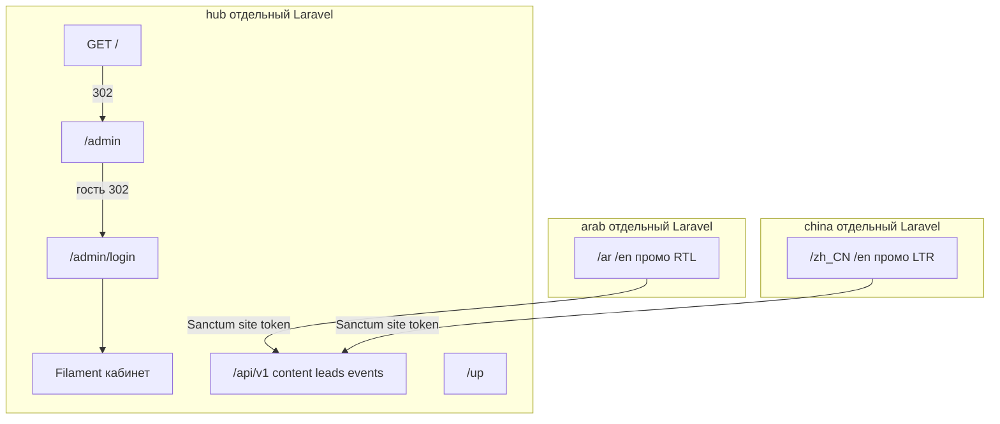

# Экспертиза: 3 независимых сайта vs ТЗ и планы

**Вердикт:** архитектура задачи выполнена. Это не один Laravel с тремя темами, а **три отдельных приложения** в одном git-репозитории, с раздельными БД и связью только по HTTPS API.

План смарт-контрактов GANITron ([ganitron_full_plan](C:\Users\S9j.cursor\plans\ganitron_full_plan_987cf3c0.plan.md)) к этому репозиторию **не относится** — в коде нет Tron/Solidity.

---

## 1. Независимость трёх сайтов — соответствует

| Требование          | Факт                                                                                                              |
| ------------------- | ----------------------------------------------------------------------------------------------------------------- |
| Три приложения      | `[hub/](hub/)`, `[arab/](arab/)`, `[china/](china/)` — каждый со своим `composer.json`, `.env`, `artisan`, SQLite |
| Нет общей БД        | Fronts не знают credentials Hub; только `HUB_URL` + `SITE_SECRET`                                                 |
| Разные домены/порты | README: Hub `:8000`, ARAB `:8001`, CHINA `:8002`; prod — 3 VDS                                                    |
| Разные токены       | Seeder пишет `storage/app/site-tokens/arab.token` и `china.token`                                                 |

Связь: `[HubClient](arab/app/Services/HubClient.php)` / china-аналог → `GET /api/v1/content`, `POST /leads`, `POST /events`. Sanctum **site** token только на сервере, не в браузере.

---

## 2. Hub — админка без публичной части — соответствует

Критичное требование («сразу авторизация в кабинет») закрыто:

- `[hub/routes/web.php](hub/routes/web.php)`: `Route::redirect('/', '/admin');`
- Гость на `/admin` → `/admin/login` (`[AdminAccessTest](hub/tests/Feature/AdminAccessTest.php)`)
- Публичная поверхность: `/api/v1/*` (Sanctum + throttle + CORS) и `/up`
- `[robots.txt](hub/public/robots.txt)`: `Disallow: /`; Filament `noindex,nofollow`
- Тесты: `[AdminHardeningTest](hub/tests/Feature/AdminHardeningTest.php)` (`test_root_redirects_to_admin`)

**Не витрина:** файл `[hub/resources/views/welcome.blade.php](hub/resources/views/welcome.blade.php)` — мёртвый скелет Laravel, **не привязан к маршруту**. На `/` пользователь его не видит. Имеет смысл удалить как гигиену, не как баг продукта.

Защита кабинета (план Phase 4): IP allowlist `[RestrictAdminByIp](hub/app/Http/Middleware/RestrictAdminByIp.php)`, 2FA TOTP (`[EnsureTwoFactorAuthenticated](hub/app/Http/Middleware/EnsureTwoFactorAuthenticated.php)`). В `.env` по умолчанию `HUB_ADMIN_2FA=false` и пустой allowlist — это local-режим, в README для production включить явно.

---

## 3. Hub MVP (план Pre-ICO Laravel) — закрыт, с оговоркой CMS-формы

**Есть:** модели Site / SiteGroup / ContentSection / ContactMessage / AnalyticsEvent / User; роли super_admin / site_manager / viewer; policies; scope All/Group/Site; Settings (цена, FX, флаги); API content/leads/events; `ip_hash`; воронка CTA → calculator → lead; CORS allowlist; rate-limit `hub-api`.

**Контент:** приоритет site > group > global в `[ContentResolver](hub/app/Services/ContentResolver.php)`. На фронте дополнительно `array_replace_recursive` с `config/site.php`, поэтому неполный Hub-payload не ломает страницу.

**Оговорка (не блокер MVP, блокер удобства редактора):** payload в Filament — `KeyValue` (`[ContentSectionResource](hub/app/Filament/Resources/ContentSectionResource.php)` ~строка 105). Вложенные массивы (allocations, vesting, team, FAQ) в БД через seeder живут, но **сохранение из UI может сплющить JSON**. Для продакшен-редактирования секций нужен JSON/Repeater, не KeyValue.

**Seeder частично:** social, tokenomics (vesting/utility), roadmap до Q4 2028, china technology — сидятся. **Не сидятся:** partners, security, testimonials, sharia — фронт берёт их из fallback. Shared group-секции в seeder только `en` (без ar/zh_CN шаблонов). Это незакрытый пункт spec-gap (`tests-seeder`).

**Частично vs «switcher на каждом списке»:** All/Group/Site фильтрует Eloquent-запросы ресурсов, но виджет переключателя в основном на Dashboard, не в header Leads/Content.

**Мелочи hardening (не ломают изоляцию админки):** токены выпускаются с ability `site:api`, но API это не проверяет (`tokenCan`); group/global контент виден менеджеру не только своих групп; `/login` не алиас на `/admin/login`.

`hub/composer.json` всё ещё `name: laravel/laravel` — косметика.

---

## 4. ARAB — соответствует правилам и доработкам spec-gap

- Локали `ar`+`en`, RTL для `ar`; `/` → `/ar`
- Палитра золото/изумруд; шрифты Cairo + Tajawal + Montserrat (Bunny Fonts)
- Секции: Hero, About, Tokenomics+калькулятор, Roadmap, Team, Partners, Security, **Sharia**, Testimonials, FAQ, Contact, Footer, Terms/Privacy
- WhatsApp + соцсети X / Telegram / Snapchat / LinkedIn; LinkedIn у team
- Калькулятор **USD/AED/SAR/QAR**; Livewire Calculator / ContactForm / LocaleSwitcher
- Tokenomics: цена, vesting, utility; roadmap Q3 2026–Q4 2028
- Копирайт Pre-ICO / Sharia / regional blockchain **без** «первый в регионе»
- Дисклеймер DFSA/ADGM/CMA; security: audit / KYC-AML / qualified investors
- Геометрия SVG на hero/секциях/футере; whitepaper CTA скрыт без PDF
- SEO, analytics hooks, очередь retry на Hub outage

Тесты: HomePageTest, SeoLegalTest, VisualAssetsTest, PublicDownloadTest, LivewirePromoTest, EventTrackingTest (~37 meaningful).

Остаток не-кода: placeholder WhatsApp/social/LinkedIn, нет `hero-arab.jpg` и PDF (CTA скрыт), legal stubs.

---

## 5. CHINA — соответствует, комплаенс держится тестами

- Локали `zh_CN`+`en`, **только LTR**; `/` → `/zh_CN`
- Палитра красный/золото/синий; Inter + Noto Sans SC + PingFang SC
- **Technology** вместо Sharia; WeChat+QR; Weibo+Telegram
- Калькулятор **USD/CNY**, без AED/SAR/QAR/WhatsApp
- Публичный копирайт без ICO / cryptocurrency / 加密货币 — `[test_public_copy_avoids_restricted_compliance_terms](china/tests/Feature/HomePageTest.php)`
- Токенизация/цифровые активы без ICO; дисклеймер «не оферта»
- Облачный паттерн + синий акцент technology; тот же hide-PDF

QR — заглушка `[china/public/images/wechat-qr.svg](china/public/images/wechat-qr.svg)`. Hero JPG и overview PDF — кладёт заказчик.

**Оговорка комплаенса (ops):** тесты сканируют fallback и legal stubs. `HubClient` отдаёт Hub-payload как есть — запрещённые слова из админки попадут на сайт и закэшируются на TTL. Скраббера на фронте нет (сознательно: контент из Hub). На проде дисциплина редактора + не сидить ICO в CHINA-секциях.

---

## 6. Статус предыдущих планов

**Pre-ICO Laravel MVP** — все 9 todo completed (rules, Hub, ARAB, CHINA, SEO/deploy).

**Spec-gap audit:**

- social-team, tokenomics-roadmap, copy-legal, visual-fonts — **done**
- tests-seeder — **частично:** Feature-тесты фронтов обновлены; Hub seeder без partners/security/testimonials/sharia

**Сознательно вне MVP (не дыры):** WeChat Mini Program, live FX, AMP, KYC SSO, geo-block КНР, реклама/конференции, лицензионные фото/реальные PDF/логотипы.

---

## 7. Что ещё имеет смысл закрыть (не ломает «3 сайта»)

По приоритету:

1. **Seeder недостающих секций** в `[hub/database/seeders/DatabaseSeeder.php](hub/database/seeders/DatabaseSeeder.php)` — зеркало fallback ARAB/CHINA (partners, security, testimonials, sharia + disclaimer в footer).
2. **Редактор payload** в Filament: `Textarea` JSON или Repeater вместо `KeyValue`, иначе админ не сможет безопасно править tokenomics/team/FAQ.
3. **Гигиена Hub:** удалить неиспользуемый `welcome.blade.php`; переименовать composer package в `gamimed/hub`; опционально алиас `/login` → `/admin/login`.
4. **Hub hardening (позже):** `tokenCan('site:api')` на API; switcher в header списков; сузить policy group/global для site_manager.

Клиентские ассеты (hero JPG, whitepaper PDF, боевой WeChat QR) — не код.

Дополнительно (не блокер MVP): при падении Hub фронт кэширует fallback на весь TTL — после восстановления Hub нужен `cache:clear` на VDS. Внешний URL whitepaper считается «есть файл» без HEAD-проверки.