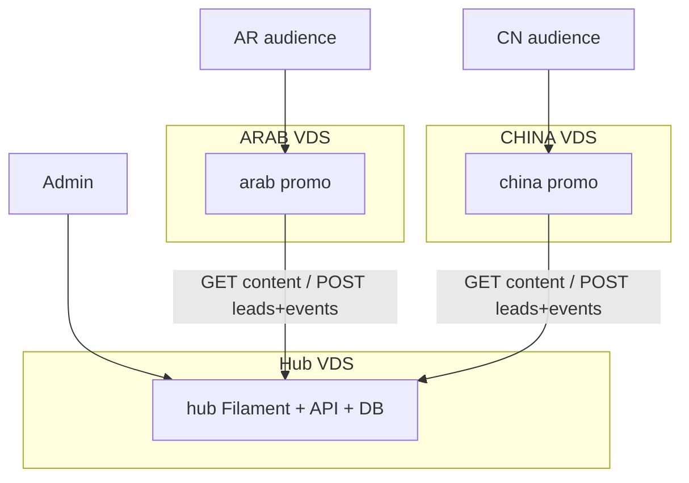

# GAMIMED Pre-ICO Promo (Hub + ARAB + CHINA)

Monorepo with three Laravel 11 apps. The Hub is the database of record; promo fronts never share its DB.

| App | Path | Role | Typical VDS |
|-----|------|------|-------------|
| **Hub** | `hub/` | Filament 3 admin, JSON API, DB of record | EU or SG (reachable from both fronts) |
| **ARAB** | `arab/` | Promo `ar`+`en` RTL | UAE or EU + Cloudflare |
| **CHINA** | `china/` | Promo `zh_CN`+`en` LTR | HK or SG |



## Local development

```bash
# Hub
cd hub && cp .env.example .env && php artisan key:generate
php artisan migrate --seed
php artisan serve --port=8000

# ARAB (separate terminal)
cd arab && cp .env.example .env && php artisan key:generate
# SITE_SECRET = contents of hub/storage/app/site-tokens/arab.token
php artisan migrate
npm install && npm run build
php artisan serve --port=8001
php artisan queue:work

# CHINA (separate terminal)
cd china && cp .env.example .env && php artisan key:generate
# SITE_SECRET = contents of hub/storage/app/site-tokens/china.token
php artisan migrate
npm install && npm run build
php artisan serve --port=8002
php artisan queue:work
```

Default Hub login: `HUB_ADMIN_EMAIL` / `HUB_ADMIN_PASSWORD` in `hub/.env`.

## Production: three VDS

### 1. Hub (EU/SG)

- PHP 8.2+, Composer, nginx (or Caddy), SQLite or MySQL, `php artisan queue:work` if you add Hub jobs later.
- Public surface: `/api/v1/*` (HTTPS) and `/up` (health). Put `/admin` behind VPN **and** `HUB_ADMIN_ALLOWED_IPS`.
- Do not expose Filament on the same hostname as a public marketing site.

**Hub `.env` (required)**

| Variable | Purpose |
|----------|---------|
| `APP_URL` | Canonical Hub URL, e.g. `https://admin.example.com` |
| `APP_KEY` | `php artisan key:generate` |
| `HUB_ADMIN_EMAIL` / `HUB_ADMIN_PASSWORD` | First super-admin (seeder) |
| `CORS_ALLOWED_ORIGINS` | Front origins, comma-separated (`https://arab.example.com,https://china.example.com`) |
| `ARAB_DOMAIN` / `CHINA_DOMAIN` | Site domains stored on seed / Filament Sites |
| `HUB_ADMIN_ALLOWED_IPS` | Office/VPN egress IPs or CIDR. **Empty = open admin (local only).** |
| `HUB_TRUSTED_PROXIES` | `*` when nginx/Cloudflare terminate TLS in front of PHP |
| `HUB_ADMIN_2FA` | `true` in production — TOTP (or recovery codes) every Filament session |

### 2. ARAB (UAE/EU + Cloudflare)

- Same PHP stack. Database queue worker **must** run (`php artisan queue:work`) so Hub lead/event retries fire.
- Point DNS at Cloudflare; proxy orange-cloud; SSL Full (strict) once origin certs exist.

**ARAB `.env` (required)**

| Variable | Purpose |
|----------|---------|
| `APP_URL` | Public origin, e.g. `https://arab.example.com` |
| `HUB_URL` | Hub origin, e.g. `https://admin.example.com` (no trailing slash) |
| `SITE_KEY` | `arab` |
| `SITE_SECRET` | Sanctum **site** token from Hub (never commit; never expose to the browser) |
| `HUB_CONTENT_CACHE_TTL` | 300–900 seconds (default 600) |

Optional: `GA4_MEASUREMENT_ID`, `YANDEX_METRIKA_ID`, `BAIDU_ANALYTICS_ID`, `SEO_OG_IMAGE`.

### 3. CHINA (HK/SG)

Same as ARAB with `SITE_KEY=china` and that site’s token. Typical extra: `BAIDU_ANALYTICS_ID`. Public copy must stay free of «ICO» / «cryptocurrency» wording.

Keep a queue worker running on this VDS as well.

## API keys (site tokens)

1. On Hub: `php artisan migrate --seed` **or** Filament → Sites → **Issue API token**.
2. Seeder writes gitignored files: `hub/storage/app/site-tokens/arab.token` and `china.token`.
3. Paste each token into the matching front `SITE_SECRET`.
4. Fronts send `Authorization: Bearer {SITE_SECRET}` only from the server (`HubClient`). Rotate a token from Filament if it leaks; then update that front’s `.env` and reload PHP.

CORS must list the exact front origins. Tokens are per site, not shared between ARAB and CHINA.

## Cloudflare (ARAB, optional on others)

- DNS A/AAAA → VDS, proxied.
- SSL/TLS: Full (strict) with an origin certificate on nginx.
- Page Rules / Cache: bypass `/track` (POST) and Livewire endpoints; cache static `build/assets`.
- If Hub is also behind a proxy, set `HUB_TRUSTED_PROXIES=*` so IP allowlisting sees the client (or `CF-Connecting-IP` via trusted proxies).

## Content publish checklist (Hub)

1. Open Filament `/admin` (VPN + allowlisted IP; complete 2FA if enabled).
2. Set scope to **All**, a **group**, or a **site** (ARAB / CHINA).
3. Content sections: edit payload per locale (`ar` / `zh_CN` / `en`), set status **published**. Site overrides win over group/global for that site.
4. Settings: pre-sale price (USD), FX rates, feature flags.
5. Confirm CHINA public strings still avoid ICO / cryptocurrency wording.
6. Fronts pick up content within `HUB_CONTENT_CACHE_TTL` (5–15 min). To force: `php artisan cache:clear` on the front VDS.
7. Smoke-test `/ar` and `/zh_CN`, contact form, calculator, `/sitemap.xml`, `/privacy`, `/terms`.
8. Confirm Hub Stats shows `page_view` / CTA / lead events after the front queue worker has run.

## Front SEO & legal

Each promo app serves:

- Meta description, canonical, hreflang, Open Graph
- `/robots.txt` and `/sitemap.xml`
- Privacy / terms stubs under `/{locale}/privacy` and `/{locale}/terms` (placeholder copy pending legal review)

External analytics (GA4, Yandex, Baidu) are optional hooks and **do not** replace Hub first-party events.

## Per-app docs

- [hub/README.md](hub/README.md)
- [arab/README.md](arab/README.md)
- [china/README.md](china/README.md)
