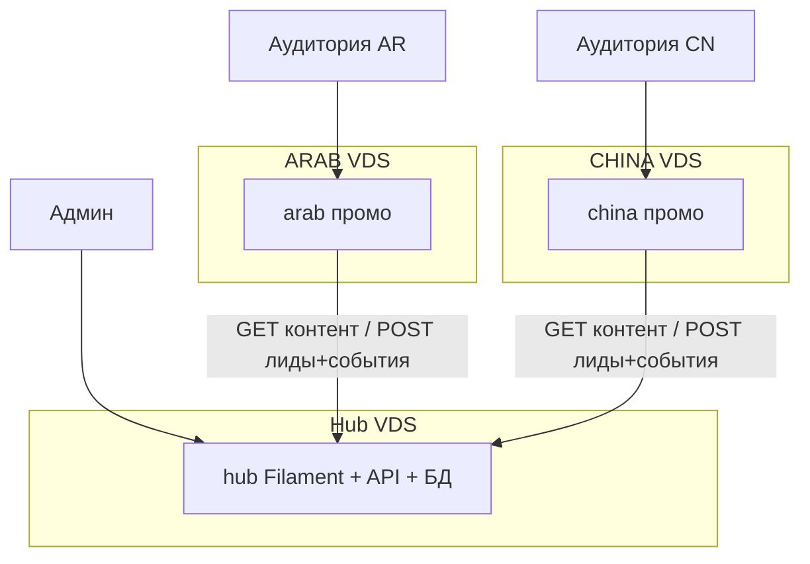

# GAMIMED Pre-ICO Promo (Hub + ARAB + CHINA)

Monorepo из трёх приложений на Laravel 11. Hub — база данных истины; промо-фронты её БД не используют.

| Приложение | Путь | Роль | Типичный VDS |
|------------|------|------|--------------|
| **Hub** | `hub/` | Админка Filament 3, JSON API, БД истины | EU или SG (доступен с обоих фронтов) |
| **ARAB** | `arab/` | Промо `ar`+`en`, RTL | ОАЭ или EU + Cloudflare |
| **CHINA** | `china/` | Промо `zh_CN`+`en`, LTR | HK или SG |



## Локальная разработка

```bash
# Hub
cd hub && cp .env.example .env && php artisan key:generate
php artisan migrate --seed
php artisan serve --port=8000

# ARAB (отдельный терминал)
cd arab && cp .env.example .env && php artisan key:generate
# SITE_SECRET = содержимое hub/storage/app/site-tokens/arab.token
php artisan migrate
npm install && npm run build
php artisan serve --port=8001
php artisan queue:work

# CHINA (отдельный терминал)
cd china && cp .env.example .env && php artisan key:generate
# SITE_SECRET = содержимое hub/storage/app/site-tokens/china.token
php artisan migrate
npm install && npm run build
php artisan serve --port=8002
php artisan queue:work
```

Логин в Hub по умолчанию: `HUB_ADMIN_EMAIL` / `HUB_ADMIN_PASSWORD` в `hub/.env`.

В `.env.example` фронтов указан MySQL (`ar` / `ch`). Для SQLite задайте `DB_CONNECTION=sqlite` и создайте `database/database.sqlite`.

## Продакшен: три VDS

### 1. Hub (EU/SG)

- PHP 8.2+, Composer, nginx (или Caddy), SQLite или MySQL, `php artisan queue:work` — если позже появятся jobs на Hub.
- Публичная поверхность: `/api/v1/*` (HTTPS) и `/up` (health). `/admin` — за VPN **и** `HUB_ADMIN_ALLOWED_IPS`.
- Не выставляйте Filament на том же hostname, что и маркетинговый сайт.

**Hub `.env` (обязательно)**

| Переменная | Назначение |
|------------|------------|
| `APP_URL` | Канонический URL Hub, например `https://admin.example.com` |
| `APP_KEY` | `php artisan key:generate` |
| `HUB_ADMIN_EMAIL` / `HUB_ADMIN_PASSWORD` | Первый super-admin (сидер) |
| `CORS_ALLOWED_ORIGINS` | Origin’ы фронтов через запятую (`https://arab.example.com,https://china.example.com`) |
| `ARAB_DOMAIN` / `CHINA_DOMAIN` | Домены сайтов в сидере / Filament Sites |
| `HUB_ADMIN_ALLOWED_IPS` | IP офиса/VPN или CIDR. **Пусто = админка открыта (только локально).** |
| `HUB_TRUSTED_PROXIES` | `*` если TLS терминируют nginx/Cloudflare перед PHP |
| `HUB_ADMIN_2FA` | `true` в проде — TOTP (или recovery-коды) на каждую сессию Filament |

### 2. ARAB (ОАЭ/EU + Cloudflare)

- Тот же стек PHP. Воркер очереди **обязан** работать (`php artisan queue:work`), иначе retry лидов и событий на Hub не уйдут.
- DNS на Cloudflare; прокси (оранжевое облако); SSL Full (strict) после появления origin-сертификата.

**ARAB `.env` (обязательно)**

| Переменная | Назначение |
|------------|------------|
| `APP_URL` | Публичный origin, например `https://arab.example.com` |
| `HUB_URL` | Origin Hub, например `https://admin.example.com` (без слэша в конце) |
| `SITE_KEY` | `arab` |
| `SITE_SECRET` | Sanctum-токен **сайта** из Hub (не коммитить; не отдавать в браузер) |
| `HUB_CONTENT_CACHE_TTL` | 300–900 секунд (по умолчанию 600) |

Опционально: `GA4_MEASUREMENT_ID`, `YANDEX_METRIKA_ID`, `BAIDU_ANALYTICS_ID`, `SEO_OG_IMAGE`.

### 3. CHINA (HK/SG)

Как ARAB, но `SITE_KEY=china` и токен этого сайта. Обычно ещё `BAIDU_ANALYTICS_ID`. В публичных текстах нельзя «ICO» / «cryptocurrency».

На этом VDS тоже держите queue worker.

## API-ключи (токены сайтов)

1. На Hub: `php artisan migrate --seed` **или** Filament → Sites → **Issue API token**.
2. Сидер пишет gitignored-файлы: `hub/storage/app/site-tokens/arab.token` и `china.token`.
3. Вставьте каждый токен в `SITE_SECRET` соответствующего фронта.
4. Фронты шлют `Authorization: Bearer {SITE_SECRET}` только с сервера (`HubClient`). Если токен утёк — перевыпустите в Filament, обновите `.env` фронта и перезагрузите PHP.

В CORS должны быть точные origin’ы фронтов. Токены раздельные: ARAB и CHINA не делят один ключ.

## Cloudflare (ARAB, на остальных по желанию)

- DNS A/AAAA → VDS, proxied.
- SSL/TLS: Full (strict) и origin-сертификат на nginx.
- Page Rules / Cache: не кэшировать `POST /track` и эндпоинты Livewire; кэшировать статику `build/assets`.
- Если Hub тоже за прокси, задайте `HUB_TRUSTED_PROXIES=*`, чтобы IP-allowlist видел клиента (или `CF-Connecting-IP` через trusted proxies).

## Чеклист публикации контента (Hub)

1. Откройте Filament `/admin` (VPN + IP из allowlist; пройдите 2FA, если включена).
2. Выберите scope: **All**, **группу** или **сайт** (ARAB / CHINA).
3. Секции: правьте payload по локалям (`ar` / `zh_CN` / `en`), статус **published**. Site override побеждает group/global для этого сайта.
4. Settings: цена pre-sale (USD), курсы FX, feature flags.
5. Проверьте, что публичные строки CHINA по-прежнему без ICO / cryptocurrency.
6. Фронты подхватят контент за `HUB_CONTENT_CACHE_TTL` (5–15 мин). Принудительно: `php artisan cache:clear` на VDS фронта.
7. Смоук: `/ar` и `/zh_CN`, форма, калькулятор, `/sitemap.xml`, `/privacy`, `/terms`.
8. В Hub Stats должны появиться `page_view` / CTA / lead после отработки queue worker на фронте.

## SEO и юридические страницы фронтов

Каждое промо-приложение отдаёт:

- Meta description, canonical, hreflang, Open Graph
- `/robots.txt` и `/sitemap.xml`
- Заглушки privacy / terms: `/{locale}/privacy` и `/{locale}/terms` (тексты до юридического review)

Внешняя аналитика (GA4, Яндекс, Baidu) — опциональные хуки и **не заменяет** first-party события Hub.

## Документация приложений

- [hub/README.md](hub/README.md)
- [arab/README.md](arab/README.md)
- [china/README.md](china/README.md)
