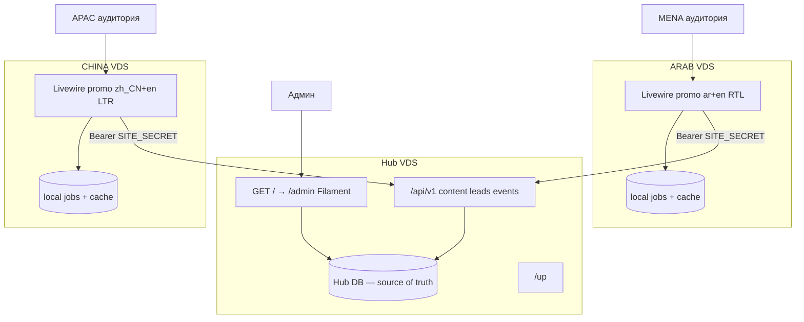
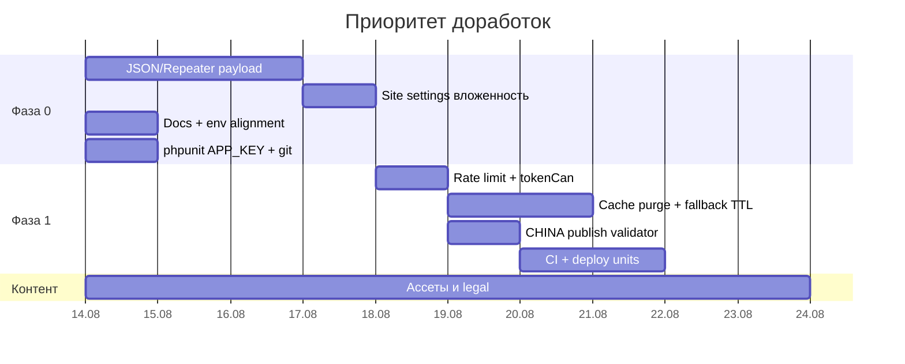

# GAMIMED Pre-ICO Promo — полный отчёт

**Дата:** 13 августа 2026  
**Репозиторий:** monorepo из трёх независимых Laravel 11-приложений (`hub/`, `arab/`, `china/`)  
**Среда проверки:** Windows 10, PHP 8.2.12, PHPUnit 11  
**Git:** ветка `main` без коммитов (весь код пока untracked)

---

## 1. Краткий вердикт

Архитектура задачи выполнена: это не один Laravel с тремя темами, а **три отдельных приложения** с раздельными БД и связью только по HTTPS JSON API. MVP промо-сайтов и кабинета Hub закрыт. Автотесты зелёные.

| Приложение | Тесты | Утверждения | Результат |
|------------|-------|-------------|-----------|
| Hub | 30 | 89 | все прошли |
| ARAB | 39 | 264 | все прошли |
| CHINA | 43 | 346 | все прошли |
| **Итого** | **112** | **699** | **OK** |

**Готовность к локальной разработке:** высокая.  
**Готовность к бою:** условная. Код MVP есть, но перед продом обязательны: hardening Hub (2FA, IP allowlist, MySQL, не дефольный пароль), рабочий CMS-редактор вложенного JSON, queue worker на фронтах, клиентские ассеты (hero/PDF/QR), юридические тексты, CI и шаблоны nginx/systemd.

Главный продуктовый блокер удобства админки: payload секций в Filament — `KeyValue`. Вложенные массивы (tokenomics, team, FAQ) seeder кладёт корректно, но **сохранение из UI может сплющить JSON**.

---

## 2. Структура репозитория

```
.
├── README.md                 # обзор + localhost + 3 VDS
├── ОТЧЕТ.md                  # этот документ
├── .cursor/                  # правила и внутренние планы
│   ├── rules/
│   │   ├── project-overview.mdc
│   │   └── laravel-conventions.mdc
│   └── plans/
├── hub/                      # Filament-кабинет + JSON API + БД истины
├── arab/                     # промо ar+en, RTL
└── china/                    # промо zh_CN+en, LTR
```

Каждое приложение — полноценный Laravel 11:

| Каталог | Назначение |
|---------|------------|
| `app/` | код (модели, контроллеры, Livewire/Filament, сервисы) |
| `bootstrap/` | Laravel 11 Application builder, middleware |
| `config/` | `app.php`, на фронтах `site.php`, в Hub `hub.php` / `cors.php` / `sanctum.php` |
| `database/migrations/` | схема |
| `database/seeders/` | начальные данные (Hub) |
| `database/data/` | JSON-подобные PHP-пейлоады секций (Hub) |
| `public/` | document root, ассеты, `index.php` |
| `resources/views/` | Blade / секции / Livewire / Filament views |
| `resources/css/`, `resources/js/` | Tailwind + Vite |
| `lang/` | UI/SEO/legal/calculator/contact (только фронты) |
| `routes/` | `web.php`, у Hub ещё `api.php` |
| `tests/` | PHPUnit Feature + Unit |
| `.env.example` | шаблон окружения |

Общих `composer.json`, Docker, GitHub Actions, nginx и systemd-юнитов **нет**. Деплой — три независимых VDS.

### 2.1. Hub — состав `app/`

| Слой | Что есть |
|------|----------|
| Models | `Site`, `SiteGroup`, `ContentSection`, `ContactMessage`, `AnalyticsEvent`, `HubSetting`, `User` |
| Enums | `UserRole`, `SiteStatus`, `ContentStatus`, `LeadStatus` |
| API | `Api\V1\ContentController`, `LeadController`, `EventController` |
| Services | `ContentResolver`, `AdminScope`, `AnalyticsStats`, `Totp` |
| Middleware | `RestrictAdminByIp`, `EnsureTwoFactorAuthenticated`, `EnsureSiteIsActive` |
| Filament resources | Sites, Site Groups, Content Sections, Leads, Analytics Events, Users |
| Filament pages | Dashboard, Manage Settings, 2FA setup/challenge |
| Widgets | Scope switcher, period filter, stats overview, funnel chart |
| Policies | на все основные модели |

### 2.2. ARAB / CHINA — состав `app/` (зеркала)

| Слой | Классы |
|------|--------|
| Hub-клиент | `Services\HubClient` |
| Jobs | `RetryHubLeadJob`, `RetryHubEventJob` |
| Livewire | `InvestmentCalculator`, `ContactForm`, `LocaleSwitcher` |
| HTTP | `HomeController`, `LegalController`, `SeoController`, `TrackEventController` |
| Middleware | `SetLocale` |
| Support | `SeoMeta`, `PublicDownload` |

Секции Blade (`resources/views/sections/`):

| ARAB | CHINA |
|------|-------|
| hero, about, tokenomics, roadmap, team, partners, security, **sharia**, testimonials, faq, contact, footer | то же, но **technology** вместо sharia |

Плюс `_header`, `_social-links`, `_social-icon`; legal stubs; SEO sitemap; analytics partial.

### 2.3. Публичные ассеты

**ARAB** (закоммичены SVG-паттерны): `pattern-geometry.svg`, `pattern-mashrabiya.svg`, `pattern-calligraphy.svg`, `pattern-blockchain.svg`.  
**CHINA:** `pattern-cloud.svg`, `pattern-tech.svg`, `pattern-lattice.svg`, `pattern-dragon.svg`, `pattern-phoenix.svg`, заглушка `wechat-qr.svg`.

Hero JPG и whitepaper PDF **не в git** (gitignore: `public/images/*.jpg`, `public/downloads/*.pdf`). CTA whitepaper скрывается, если файла нет.

---

## 3. Архитектура



### 3.1. Принципы

1. **Hub — единственная БД истины.** Сайты, группы, контент, лиды, события, настройки.
2. **Фронты не знают credentials Hub.** Только `HUB_URL` + `SITE_KEY` + `SITE_SECRET`.
3. **Контент на фронте:** Hub GET → cache TTL 5–15 мин → fallback `config/site.php`.
4. **Лиды:** синхронный POST; при ошибке — job в локальной очереди фронта (5 попыток, backoff 60 с).
5. **События:** всегда через очередь фронта (`RetryHubEventJob`), затем POST на Hub. Без `queue:work` аналитика в Hub **не попадёт**, даже если Hub жив.
6. **Sanctum site token** живёт только на сервере фронта (`HubClient`). В браузер не отдаётся.
7. **CORS** на Hub — allowlist origin’ов фронтов. Для server-to-server CORS не участвует; это страховка от случайного вызова API из браузера.

### 3.2. Модель сайтов и групп

Seeder создаёт:

| Группа | Slug | Состав |
|--------|------|--------|
| All Pre-ICO | `all-preico` | ARAB + CHINA |
| MENA | `mena` | ARAB |
| APAC | `apac` | CHINA |

Сайты: `arab` (локали `ar`, `en`; валюты USD/AED/SAR/QAR; WhatsApp) и `china` (`zh_CN`, `en`; USD/CNY; WeChat).

Filament-контекст: **All / Group / Site** (`AdminScope`, виджет на Dashboard). Ресурсы фильтруют Eloquent-запросы. Переключатель в шапке списков Leads/Content **не вынесен** — только на дашборде.

### 3.3. Резолв контента

Приоритет в Hub (`ContentResolver`): **site override > group > global**. Черновики не отдаются API.

На фронте `HubClient::normalizeContentPayload()` делает `array_replace_recursive` с `config/site.php`, поэтому неполный Hub-payload не ломает страницу.

### 3.4. Роли Hub

| Роль | Доступ |
|------|--------|
| `super_admin` | всё, выпуск токенов, создание сайтов |
| `site_manager` | запись в своих сайтах; group/global секции видит (policy шире, чем «только свои») |
| `viewer` | чтение |

Seeder: `HUB_ADMIN_EMAIL` / `HUB_ARAB_MANAGER_EMAIL` / `HUB_CHINA_MANAGER_EMAIL` / `HUB_VIEWER_EMAIL`. Пароль у всех один — `HUB_ADMIN_PASSWORD` (в example: `password`).

### 3.5. Стек

| | Hub | ARAB | CHINA |
|---|-----|------|-------|
| PHP | ^8.2 | ^8.2 | ^8.2 |
| Laravel | 11.31 | 11.31 | 11.31 |
| UI | Filament 3.3 | Livewire 3.5 | Livewire 3.5 |
| CSS | Tailwind 3 + Vite 6 | Tailwind 4 + Vite 6 | Tailwind 4 + Vite 6 |
| Auth API | Sanctum 4.3 | — | — |
| Composer name | `laravel/laravel` (не переименован) | `gamimed/arab` | `gamimed/china` |
| БД в `.env.example` | SQLite | MySQL `ar` | MySQL `ch` |
| Очередь / кэш / сессии | database | database | database |

---

## 4. Программная часть

### 4.1. Публичные маршруты

**Hub**

| Метод | Путь | Назначение |
|-------|------|------------|
| GET | `/` | 302 → `/admin` |
| — | `/admin/*` | Filament (IP allowlist + 2FA) |
| GET | `/api/v1/content` | опубликованные секции + settings |
| POST | `/api/v1/leads` | лид |
| POST | `/api/v1/events` | first-party event |
| GET | `/up` | health |

API: `auth:sanctum` + `EnsureSiteIsActive` + throttle `hub-api` (120 запросов/мин на сайт).

**ARAB**

| Путь | Назначение |
|------|------------|
| `/` | → `/ar` |
| `/{ar\|en}` | главная |
| `/{locale}/terms`, `/{locale}/privacy` | legal stubs |
| `/robots.txt`, `/sitemap.xml` | SEO |
| POST `/track` | CSRF + throttle 60/мин, события с фронта |

**CHINA** — то же с `zh_CN`/`en`; дополнительно `/china` → `/zh_CN`.

### 4.2. Контракт Hub API

Аутентификация: `Authorization: Bearer {SITE_SECRET}`. Сайт — Sanctum-tokenable (`Site` implements `Authenticatable` + `HasApiTokens`). Заголовок `X-Site-Key` фронт шлёт, **Hub его не проверяет** (истина — tokenable Site). Ability `site:api` при выпуске токена задаётся, на API **`tokenCan` не вызывается**.

**GET `/api/v1/content?locale=`**

```json
{
  "site": {
    "slug": "arab",
    "name": "ARAB Promo",
    "locale": "ar",
    "locales": ["ar", "en"],
    "settings": { "presale_price_usd": 0.05, "fx_rates": {}, "feature_flags": {}, "currencies": [] }
  },
  "sections": [
    { "section_key": "hero", "locale": "ar", "payload": {}, "source": "site" }
  ]
}
```

**POST `/api/v1/leads`** — хотя бы одно из: email, phone, messenger, message. Пишется `ip_hash` (HMAC-SHA256 от IP с `APP_KEY`), не сырой IP. Статус `new`.

**POST `/api/v1/events`** — типы: `page_view`, `cta_click`, `calculator_use`, `contact_submit`, `whitepaper_download`.

### 4.3. HubClient (фронт)

- GET content с retry (`HUB_HTTP_RETRIES`, timeout `HUB_HTTP_TIMEOUT`).
- Кэш ключ `hub.content.{site}.{locale}`, TTL `HUB_CONTENT_CACHE_TTL` (по умолчанию 600 с).
- При ошибке Hub — fallback из `config/site.php`; **этот fallback тоже кладётся в кэш на весь TTL**. После восстановления Hub до истечения TTL фронт может продолжать показывать fallback, пока не сделают `cache:clear` / `forgetContentCache()`. Метода инвалидации с Hub (webhook/purge) нет.
- `trackEvent()` сначала `dispatch(RetryHubEventJob)` — очередь обязательна.
- `submitLead()` сначала HTTP, при фейле — `RetryHubLeadJob`.

### 4.4. Livewire MVP

**InvestmentCalculator.** Валюты и FX из Hub settings; ARAB: USD/AED/SAR/QAR; CHINA: USD/CNY. Цена pre-sale из Hub. Событие `calculator_use` один раз за визит. Флаг `feature_flags.calculator_enabled`.

**ContactForm.** Rate limit 5/мин по IP. Хотя бы один канал связи. Лид + `contact_submit`. Успех показывается даже если Hub недоступен (очередь retry). Флаг `feature_flags.contact_form`.

**LocaleSwitcher.** Cookie + session + redirect на `/{locale}`.

Клиентский трекинг: `resources/js/app.js` слушает `[data-track]`, POST `/track` с CSRF, дублирует в GA4/Yandex/Baidu если заданы ID.

### 4.5. Безопасность (как сделано)

| Мера | Статус |
|------|--------|
| CSRF на web-формах и `/track` | есть |
| Sanctum token только server-side | есть |
| IP allowlist `/admin` | есть, **пустой = открыто** |
| 2FA TOTP + recovery | есть, **выключено** (`HUB_ADMIN_2FA=false`) |
| `robots.txt` Hub `Disallow: /`, meta noindex | есть |
| Rate limit API 120/мин, `/track` 60/мин, форма 5/мин | есть |
| `ip_hash` вместо IP | есть |
| CORS allowlist | есть |
| Токены в `storage/app/site-tokens/` gitignored | есть |
| Inactive site → 403 API | есть |
| Path traversal на PDF (`PublicDownload`) | есть |
| CHINA: запрет ICO / cryptocurrency / 加密货币 в fallback | тесты есть; **Hub-payload не скрабится** |

### 4.6. SEO и комплаенс

На обеих витринах: title/description, canonical, hreflang, Open Graph, JSON-LD, `/robots.txt`, `/sitemap.xml`. Privacy/terms — **заглушки**, ждут юридический review.

CHINA: публичный копирайт без «ICO» / «cryptocurrency» / «加密货币»; WeChat вместо WhatsApp; секция Technology, не Sharia. Тесты сканируют fallback и stubs. Контент из админки попадёт на сайт как есть и закэшируется.

ARAB: RTL для `ar`, дисклеймер DFSA/ADGM/CMA в fallback, Sharia-секция. Копирайт Pre-ICO / regional blockchain без формулировки «первый в регионе».

### 4.7. Аналитика Hub

Dashboard: page views, leads, whitepaper downloads, published/draft sections, воронка CTA → calculator → lead. Фильтр периода. События first-party — источник истины для админки; GA4/Yandex/Baidu — опциональные хуки.

---

## 5. Инструкция: запуск на localhost

Нужно: **PHP 8.2+**, **Composer**, **Node.js 20+** (npm), **три терминала**. Для фронтов по `.env.example` — **MySQL** (БД `ar` и `ch`). Hub по умолчанию — **SQLite**.

Порты: Hub `8000`, ARAB `8001`, CHINA `8002`.

### 5.1. Hub

```bash
cd hub
copy .env.example .env          # Windows
# cp .env.example .env          # Git Bash / Linux

php artisan key:generate

# SQLite (как в .env.example)
if not exist database\database.sqlite type nul > database\database.sqlite

composer install
php artisan migrate --seed
php artisan serve --port=8000
```

Кабинет: [http://localhost:8000/admin](http://localhost:8000/admin)  
Логин: `HUB_ADMIN_EMAIL` / `HUB_ADMIN_PASSWORD` (по умолчанию `admin@gamimed.local` / `password`).

Токены сайтов после сида:

- `hub/storage/app/site-tokens/arab.token`
- `hub/storage/app/site-tokens/china.token`

Перевыпуск: Filament → Sites → **Issue API token** (старый токен отзывается).

`CORS_ALLOWED_ORIGINS` в example: `http://localhost:8001,http://localhost:8002`. Если фронт открываете как `http://127.0.0.1:8001`, для браузерных запросов к Hub origin не совпадёт; server-to-server это не ломает.

### 5.2. ARAB

Создайте MySQL-базу `ar` (или переключите на SQLite — см. §5.4).

```bash
cd arab
copy .env.example .env
php artisan key:generate

# В .env:
# HUB_URL=http://127.0.0.1:8000
# SITE_KEY=arab
# SITE_SECRET=<содержимое hub/storage/app/site-tokens/arab.token без пробелов/переноса>

composer install
php artisan migrate
npm install
npm run build

php artisan serve --port=8001
```

**Отдельный терминал (обязательно для аналитики и retry лидов):**

```bash
cd arab
php artisan queue:work
```

Сайт: [http://127.0.0.1:8001](http://127.0.0.1:8001) → редирект на `/ar`.

Для hot-reload CSS/JS вместо `npm run build`: `npm run dev`.

### 5.3. CHINA

```bash
cd china
copy .env.example .env
php artisan key:generate
# SITE_KEY=china
# SITE_SECRET=<china.token>
# HUB_URL=http://127.0.0.1:8000

composer install
php artisan migrate          # БД MySQL `ch`
npm install
npm run build
php artisan serve --port=8002
```

Второй терминал: `php artisan queue:work`.

Сайт: [http://127.0.0.1:8002](http://127.0.0.1:8002) → `/zh_CN`.

### 5.4. SQLite на фронтах (проще, чем MySQL)

`.env.example` фронтов задаёт MySQL, а корневой README — SQLite. Оба варианта рабочие. Для SQLite:

```env
DB_CONNECTION=sqlite
# DB_DATABASE оставить пустым → database/database.sqlite
```

```bash
type nul > database\database.sqlite
php artisan migrate
```

Рекомендация: **выровнять README и `.env.example`**, чтобы новый разработчик не упирался в отсутствующую MySQL-базу `ar`/`ch`.

### 5.5. Локальный смоук

1. Hub `/admin` — логин, Dashboard, Sites, Content, Settings.
2. ARAB `/ar` и `/en` — все секции, калькулятор, форма, переключатель языка.
3. CHINA `/zh_CN` и `/en` — Technology, WeChat, нет Sharia/WhatsApp/AED.
4. Отправить форму → лид в Hub → Leads.
5. Клик CTA → после `queue:work` событие в Analytics.
6. `/sitemap.xml`, `/robots.txt`, `/ar/privacy`, `/zh_CN/terms`.
7. `php artisan test` в каждом приложении.

### 5.6. Типичные локальные ошибки

| Симптом | Причина | Что сделать |
|---------|---------|-------------|
| 401/403 с Hub, fallback навсегда | пустой/`неверный` `SITE_SECRET` | вставить токен, `php artisan cache:clear` |
| Нет лидов/событий в Hub | не запущен `queue:work` на фронте | запустить worker |
| Страница без стилей | не собран Vite | `npm run build` или `npm run dev` |
| `SQLSTATE[HY000] [1049] Unknown database 'ar'` | нет MySQL-базы | создать БД или SQLite |
| Форма «отправлена», в Hub пусто | Hub выключен, job ждёт worker | включить Hub + worker; смотреть `failed_jobs` |

---

## 6. Инструкция: запуск на бою

Топология: **три VDS**. Hub — EU или SG (доступен с обоих фронтов). ARAB — UAE/EU + Cloudflare. CHINA — HK/SG.

На каждом сервере: PHP 8.2+ (php-fpm), Composer, Node (только на этапе сборки), nginx (или Caddy), MySQL 8 **для продакшена** (SQLite на Hub с потоком `page_view` не подходит).

### 6.1. Общий релиз на одном VDS

```bash
cd /var/www/hub   # или arab / china
git pull
composer install --no-dev --optimize-autoloader
npm ci && npm run build          # фронты; Hub Vite почти не нужен в проде
php artisan migrate --force
php artisan config:cache
php artisan route:cache
php artisan view:cache
php artisan event:cache
sudo systemctl reload php8.2-fpm
sudo systemctl restart gamimed-queue-arab   # имя юнита — своё
```

`APP_DEBUG=false`, `APP_ENV=production`, уникальный `APP_KEY`, не коммитить `.env`.

### 6.2. nginx (схема)

Document root — `public/`. Пример для ARAB (Hub/CHINA — те же `root`/`fastcgi_pass`, свои `server_name`).

```nginx
server {
    listen 443 ssl http2;
    server_name arab.example.com;
    root /var/www/arab/public;

    ssl_certificate     /etc/ssl/certs/arab.pem;
    ssl_certificate_key /etc/ssl/private/arab.key;

    add_header X-Frame-Options "SAMEORIGIN" always;
    add_header X-Content-Type-Options "nosniff" always;
    add_header Referrer-Policy "strict-origin-when-cross-origin" always;

    location / {
        try_files $uri $uri/ /index.php?$query_string;
    }

    location ~ \.php$ {
        include snippets/fastcgi-php.conf;
        fastcgi_pass unix:/run/php/php8.2-fpm.sock;
        fastcgi_param SCRIPT_FILENAME $realpath_root$fastcgi_script_name;
    }

    location ~* ^/build/assets/ {
        expires 7d;
        add_header Cache-Control "public, immutable";
    }

    # Livewire и трекинг не кэшировать (Cloudflare Page Rule / Cache Rules)
    location = /track { try_files $uri /index.php?$query_string; }
}
```

Hub: отдельный hostname (`admin.example.com`), **не** витрина. `/admin` за VPN + `HUB_ADMIN_ALLOWED_IPS`. Не светить Filament на маркетинговом домене.

### 6.3. systemd: queue worker (фронты обязательно)

```ini
# /etc/systemd/system/gamimed-arab-queue.service
[Unit]
Description=GAMIMED ARAB queue
After=network.target mysql.service

[Service]
User=www-data
Group=www-data
Restart=always
WorkingDirectory=/var/www/arab
ExecStart=/usr/bin/php artisan queue:work database --sleep=1 --tries=5 --backoff=60 --max-time=3600
Nice=10

[Install]
WantedBy=multi-user.target
```

Аналогичный юнит для `china`. Restart через `max-time` + systemd `Restart=always` — стандартный приём Laravel. На Hub worker нужен, только если появятся свои jobs.

Проверка: `php artisan queue:failed` на фронте; в Hub — появление `page_view` после открытия витрины.

### 6.4. Переменные окружения

**Hub (обязательные в проде)**

| Переменная | Значение |
|------------|----------|
| `APP_URL` | `https://admin.example.com` |
| `APP_KEY` | `php artisan key:generate` |
| `APP_DEBUG` | `false` |
| `DB_CONNECTION` | `mysql` (рекомендуется) |
| `HUB_ADMIN_EMAIL` / `HUB_ADMIN_PASSWORD` | сильный пароль; после сида сменить |
| `CORS_ALLOWED_ORIGINS` | точные origin’ы фронтов, через запятую |
| `ARAB_DOMAIN` / `CHINA_DOMAIN` | боевые домены (сид / Filament) |
| `HUB_ADMIN_ALLOWED_IPS` | офис/VPN, IPv4 или CIDR |
| `HUB_TRUSTED_PROXIES` | `*` за nginx/Cloudflare |
| `HUB_ADMIN_2FA` | `true` |

**ARAB / CHINA**

| Переменная | ARAB | CHINA |
|------------|------|-------|
| `APP_URL` | `https://arab.example.com` | `https://china.example.com` |
| `HUB_URL` | origin Hub без `/` на конце | то же |
| `SITE_KEY` | `arab` | `china` |
| `SITE_SECRET` | токен сайта, не в git | свой токен |
| `HUB_CONTENT_CACHE_TTL` | 300–900 | 300–900 |
| `QUEUE_CONNECTION` | `database` | `database` |

Опционально: `GA4_MEASUREMENT_ID`, `YANDEX_METRIKA_ID`, `BAIDU_ANALYTICS_ID` (для CHINA типичен Baidu), `SEO_OG_IMAGE`.

### 6.5. Cloudflare (ARAB, по желанию остальные)

- DNS A/AAAA на VDS, proxy (оранжевое облако).
- SSL/TLS: **Full (strict)** + origin-сертификат на nginx.
- Cache Rules: bypass `POST /track`, `/livewire/*`; кэш `build/assets`.
- На Hub за Cloudflare обязателен `HUB_TRUSTED_PROXIES=*`, иначе IP allowlist видит IP прокси, а не клиента.

### 6.6. Чеклист публикации контента

1. `/admin` с VPN + allowlisted IP; пройти 2FA.
2. Scope: All / Group / Site.
3. Секции: payload по локалям, статус **published**. Site override побеждает group/global.
4. Settings: цена USD, FX, feature flags.
5. CHINA: в публичных строках нет ICO / cryptocurrency / 加密货币.
6. Фронты подхватят контент за TTL. Форс: `php artisan cache:clear` на VDS фронта (или будущий purge-эндпоинт).
7. Смоук: `/ar`, `/zh_CN`, форма, калькулятор, sitemap, privacy/terms.
8. Hub Stats: `page_view` / CTA / lead после отработки queue worker.

### 6.7. Ротация токена сайта

1. Filament → Sites → Issue API token (старые токены сайта удаляются).
2. Вписать новый `SITE_SECRET` в `.env` фронта.
3. `php artisan config:cache` и reload php-fpm.
4. Проверить GET content (не должен уйти в fallback).

### 6.8. Бэкапы и мониторинг

- Ежедневный дамп MySQL Hub (`sites`, `content_sections`, `contact_messages`, `analytics_events`, `users`).
- Health: `GET https://admin.example.com/up`, `GET https://arab.example.com/up`, то же для china.
- Алерты: php-fpm down, queue worker down, рост `failed_jobs`, 5xx nginx.
- Логи: `storage/logs/laravel.log` + logrotate.
- Не класть `storage/app/site-tokens` в бэкапы, доступные широкому кругу.

---

## 7. Результаты тестирования

Команда в каждом приложении: `php artisan test --compact`.

### 7.1. Hub (30 тестов)

| Набор | Что покрыто |
|-------|-------------|
| `AdminAccessTest` | гость → login; super_admin и viewer открывают панель |
| `AdminHardeningTest` | `/` → `/admin`; noindex; IP allowlist; CIDR; API не режется allowlist; 2FA setup/challenge/TOTP |
| `AdminScopeTest` | фильтр контента/лидов/событий по сайту |
| `Api\SiteApiTest` | 401 без токена; content с токеном; inactive 403; lead 201; event 201 |
| `Api\ContentResolutionTest` | site > group > global; draft не отдаётся; merge settings |
| `DatabaseSeederTest` | сайты, группы, роли, логин Filament, sharia/tokenomics/technology, CHINA без ICO |
| `TotpTest` | секрет и otpauth URI |
| `ExampleTest` | редирект `/` → `/admin` (дубль) |

### 7.2. ARAB (39 тестов)

Home (fallback и merge Hub), шрифты/паттерны, tokenomics/vesting, testimonials/security/disclaimer, whitepaper hide/show, Livewire калькулятор/форма/locale, очередь лида при падении Hub, SEO/legal/hreflang, analytics hooks, `/track`, VisualAssets, PublicDownload (PDF + traversal).

### 7.3. CHINA (43 теста)

То же + LTR, Technology, WeChat/QR, USD/CNY без AED/SAR/QAR, комплаенс-скан ICO/cryptocurrency/加密货币/WhatsApp/sharia, редирект `/china`.

### 7.4. Что автотесты не покрывают

- Реальный три-процессный прогон Hub+ARAB+CHINA по HTTP (только Http::fake / in-process).
- Сохранение Filament `KeyValue` и порча вложенного JSON.
- Поведение без `queue:work` (в тестах `QUEUE_CONNECTION=sync`).
- Нагрузочный 429 на `hub-api` 120/мин.
- Проверка `tokenCan('site:api')`.
- Скраббинг запрещённых слов из живого Hub-payload на CHINA.
- E2E браузер (Playwright/Dusk нет).
- Сборка Vite / визуальный регресс.
- Продовый nginx, TLS, Cloudflare.

`arab/phpunit.xml` **не задаёт `APP_KEY`** (в отличие от hub/china). Локально тесты ARAB прошли за счёт `.env`. На чистом CI без `.env` ARAB может упасть — это дыра пайплайна.

---

## 8. Анализ

### 8.1. Что сделано хорошо

- Три независимых приложения, изоляция БД, токен на сайт — соответствует ТЗ.
- Hub без публичной витрины: `/` сразу в кабинет.
- Fallback контента: витрина жива при падении Hub.
- Retry лидов через очередь.
- RBAC, policies, scope All/Group/Site.
- IP allowlist + TOTP реализованы и покрыты тестами.
- CHINA-комплаенс закреплён тестами на fallback.
- SEO-каркас, hreflang, скрытие whitepaper без файла.
- Seeder секций **полный** (hero…footer, sharia, technology, partners, security, testimonials) — зеркало `config/site.php`. Старый внутренний план «не сидятся partners/…» **устарел**.
- Feature-покрытие витрин заметно выше типичного MVP.

### 8.2. Риски и дефекты

#### P0 — блокер прода / админского контента

| ID | Проблема | Эффект |
|----|----------|--------|
| P0-1 | Filament `KeyValue` на `payload` секций и `settings` сайта | Сохранение tokenomics/team/FAQ/social из UI ломает вложенный JSON. Редактировать прод-контент через админку небезопасно |
| P0-2 | События **только** через queue | Без systemd `queue:work` Hub Stats пустой; лиды при сбое Hub тоже теряются в `jobs` |
| P0-3 | Дефолты hardening | `HUB_ADMIN_2FA=false`, пустой IP allowlist, пароль `password` у всех четырёх учёток |
| P0-4 | SQLite + поток analytics | Concurrent writes SQLite на Hub в проде дадут lock/потери |

#### P1 — надёжность, безопасность, ops

| ID | Проблема | Эффект |
|----|----------|--------|
| P1-1 | Общий throttle `hub-api` 120/мин на content+leads+events | Кампания/боты: 429 на лиды из‑за `page_view` |
| P1-2 | Нет purge кэша контента с Hub | Правка в админке видна до 15 мин; после outage fallback застревает на TTL |
| P1-3 | `forgetContentCache()` нигде не вызывается | Мёртвый API |
| P1-4 | CHINA: нет скраббера Hub-текста | Редактор может опубликовать ICO — уйдёт на сайт и в кэш |
| P1-5 | `tokenCan('site:api')` не проверяется | Токен с другими abilities тоже проходит |
| P1-6 | `X-Site-Key` не сверяется с tokenable | Путаница при копировании токенов; не баг авторизации, но дыра в контракте |
| P1-7 | Нет CI, Docker, nginx, systemd в репо | Каждый деплой собирается с нуля; регрессии не ловятся автоматически |
| P1-8 | README SQLite vs `.env.example` MySQL | Ломается первый локальный запуск |
| P1-9 | ARAB `phpunit.xml` без `APP_KEY` | Хрупкий CI |
| P1-10 | Git без коммитов | Нет истории, тегов, отката |

#### P2 — продукт и гигиена

| ID | Проблема |
|----|----------|
| P2-1 | Legal stubs, placeholder WhatsApp/social/LinkedIn, нет hero JPG и PDF, WeChat QR — заглушка |
| P2-2 | Scope switcher только на Dashboard |
| P2-3 | site_manager видит group/global контент всех групп |
| P2-4 | Дублирование `HubClient`, jobs, Livewire, тестов ARAB↔CHINA |
| P2-5 | `hub/composer.json` = `laravel/laravel`; мёртвый `welcome.blade.php` |
| P2-6 | Нет email/Telegram-алерта на новый лид |
| P2-7 | `PublicDownload`: любой внешний URL считается «файл есть» без HEAD |
| P2-8 | Нет экспорта лидов (CSV) |
| P2-9 | Live FX нет (сознательно вне MVP) — курсы ручные |
| P2-10 | Example-тесты Laravel частично остались |

### 8.3. Соответствие правилам проекта

| Правило | Факт |
|---------|------|
| HubClient, не вызывать Hub из Blade | соблюдено |
| Кэш 5–15 мин + fallback `config/site.php` | соблюдено |
| Лиды/events best-effort + retry | лиды — да; events всегда через queue |
| Секреты только в `.env` | соблюдено |
| CHINA без ICO/cryptocurrency | в fallback да; из Hub — дисциплина редактора |
| Нет Sanity/Strapi | соблюдено |
| Нет общей БД | соблюдено |

Вне MVP (не дыры): WeChat Mini Program, headless CMS, live FX, AMP, KYC SSO, geo-block КНР.

---

## 9. Рекомендации

1. **Не редактировать вложенные секции в Filament**, пока KeyValue не заменён на JSON/Repeater. Менять через seeder/`database/data/*.php` или прямой JSON.
2. **На бою сразу:** MySQL на Hub, `HUB_ADMIN_2FA=true`, IP allowlist, уникальные пароли, `APP_DEBUG=false`, queue workers под systemd, Full (strict) Cloudflare.
3. **Считать queue worker частью приложения фронта**, наравне с php-fpm. Алерт, если процесс мёртв.
4. **Развести rate limit:** отдельно events (выше), отдельно leads (жёстче), content — cacheable.
5. **Добавить сброс кэша:** artisan-команда на фронте + опционально signed webhook с Hub после publish.
6. **CHINA:** либо pre-publish валидатор в Filament (запрещённые слова), либо отказ публиковать china-override с ICO.
7. **Выровнять документацию** localhost (один источник правды по БД).
8. **Первый коммит + CI** (`php artisan test` × 3) до любого прод-деплоя.
9. **Клиентские ассеты** (лицензионные hero, PDF, боевой WeChat QR, реальные соцссылки) — блокер маркетингового запуска, не кода.
10. **Юридический review** privacy/terms до открытия доменов индексации.

---

## 10. План исправлений и доработок

Оценка — относительная (S ≤ 0.5 дн, M 1–2 дн, L 3–5 дн).

### Фаза 0 — до первого прода (обязательно)

| # | Задача | Приложения | Оценка | Критерий готовности |
|---|--------|------------|--------|---------------------|
| 0.1 | Заменить `KeyValue` payload на `Textarea` JSON с валидацией **или** Repeater по `section_key` (hero/faq/team/tokenomics) | hub | L | Сохранение FAQ/tokenomics из UI не плющит массивы; Feature-тест на round-trip |
| 0.2 | То же для `Site.settings` (social, whatsapp, wechat — вложенные) | hub | M | Social-массив переживает Edit Site |
| 0.3 | Прод-runbook в репо: nginx, systemd queue, MySQL, чеклист `.env` | docs | M | Новый админ поднимает VDS по файлу |
| 0.4 | Выровнять README и `.env.example` фронтов (SQLite **или** MySQL, один путь) | arab, china, README | S | `cp .env.example` + migrate без ручной правки |
| 0.5 | `APP_KEY` в `arab/phpunit.xml` | arab | S | тесты на чистой машине без `.env` |
| 0.6 | Сменить сидер-пароли; в README явно «сменить после первого входа» | hub | S | в example нет `password` как прод-совета |
| 0.7 | Первый git-коммит, `.gitignore` проверен (нет `.env`, токенов, `vendor`) | repo | S | `git status` чистый от секретов |

### Фаза 1 — надёжность и безопасность (сразу после запуска)

| # | Задача | Оценка | Критерий |
|---|--------|--------|----------|
| 1.1 | `tokenCan('site:api')` на группе `/api/v1` | S | тест: токен без ability → 403 |
| 1.2 | Раздельные rate limiter’ы: events 600/мин, leads 30/мин, content 60/мин | S | нагрузочный тест не душит лиды |
| 1.3 | Artisan `hub:clear-content-cache` на фронте; опционально POST `/api/internal/purge` с HMAC | M | после publish витрина обновляется без ожидания TTL |
| 1.4 | Не кэшировать fallback при ошибке Hub **или** TTL fallback 60 с vs 600 с для live | M | после поднятия Hub контент возвращается быстрее |
| 1.5 | Filament hook: блокировка publish CHINA при ICO/cryptocurrency/加密货币 | M | тест на ContentSection |
| 1.6 | GitHub Actions: matrix hub/arab/china `composer install` + `php artisan test` | M | PR без зелёных тестов не мержится |
| 1.7 | Supervisor/systemd файлы в `deploy/` | S | копипаста на VDS |
| 1.8 | Алерт на `failed_jobs` + dead worker | M | письмо/Telegram если очередь стоит |

### Фаза 2 — CMS и кабинет

| # | Задача | Оценка | Критерий |
|---|--------|--------|----------|
| 2.1 | Scope switcher в topbar всех ресурсов, не только Dashboard | M | Leads/Content фильтруются без возврата на home |
| 2.2 | Сузить policy: site_manager не видит чужой group/global | M | тест AdminScope + policy |
| 2.3 | Уведомление super_admin о новом лиде (mail/Telegram) | M | письмо при POST /leads |
| 2.4 | CSV-экспорт лидов в Filament | S | кнопка Export |
| 2.5 | Алиас `/login` → `/admin/login` | S | привычный URL |
| 2.6 | Удалить `welcome.blade.php`; `composer.json` → `gamimed/hub` | S | гигиена |

### Фаза 3 — продукт и контент (не код-блокер)

| # | Задача | Оценка | Владелец |
|---|--------|--------|----------|
| 3.1 | Лицензионные hero JPG ARAB/CHINA | — | контент |
| 3.2 | Whitepaper/overview PDF; включится CTA автоматически | — | контент |
| 3.3 | Боевой WeChat QR и WeChat ID | — | контент |
| 3.4 | Реальные WhatsApp, X, Telegram, Snapchat, LinkedIn, Weibo | — | маркетинг |
| 3.5 | Юридические privacy/terms (не stub) | — | юристы |
| 3.6 | LinkedIn членов команды (сейчас example-*) | — | HR/маркетинг |

### Фаза 4 — после MVP (бэклог)

| # | Задача | Комментарий |
|---|--------|-------------|
| 4.1 | Общий пакет `gamimed/hub-client` вместо копипасты ARAB/CHINA | снижает drift |
| 4.2 | Пакетная отправка events (bulk POST) | снизит давление на 120/мин |
| 4.3 | Redis cache/queue вместо database | если трафик вырастет |
| 4.4 | HEAD-проверка внешнего whitepaper URL | P2-7 |
| 4.5 | Live FX | сознательно вне MVP |
| 4.6 | E2E Playwright по трём портам | закрывает пробел Http::fake |
| 4.7 | Pint + PHPStan в CI | качество |
| 4.8 | Инвалидация кэша Filament settings (Hub 300 с) синхронно с фронтом | сейчас два TTL |

---

## 11. Порядок работ на ближайшие две недели



**Минимальный набор, без которого не открывать домены в индекс:** фазы 0.1–0.7, queue workers, 2FA+IP, MySQL Hub, юридические заглушки заменены или `noindex` на витрине до review, реальные контакты.

---

## 12. Приложения

### A. События first-party

`page_view`, `cta_click`, `calculator_use`, `contact_submit`, `whitepaper_download`.

### B. Feature flags (Hub settings)

`calculator_enabled`, `whitepaper_download`, `contact_form`.

### C. Команды проверки качества (сейчас)

```bash
cd hub   && php artisan test
cd arab  && php artisan test
cd china && php artisan test
```

Факт на 13.08.2026: **112 passed**.

### D. Связанные документы

- [README.md](README.md) — краткий деплой
- [hub/README.md](hub/README.md)
- [arab/README.md](arab/README.md)
- [china/README.md](china/README.md)

---

*Отчёт составлен по исходному коду и прогону PHPUnit. Нагрузочное и браузерное E2E тестирование не выполнялись.*
